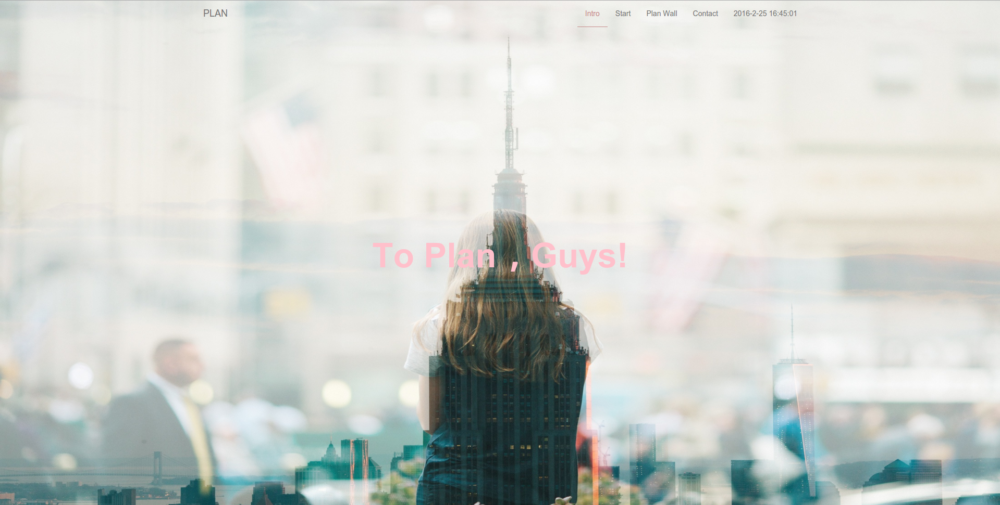
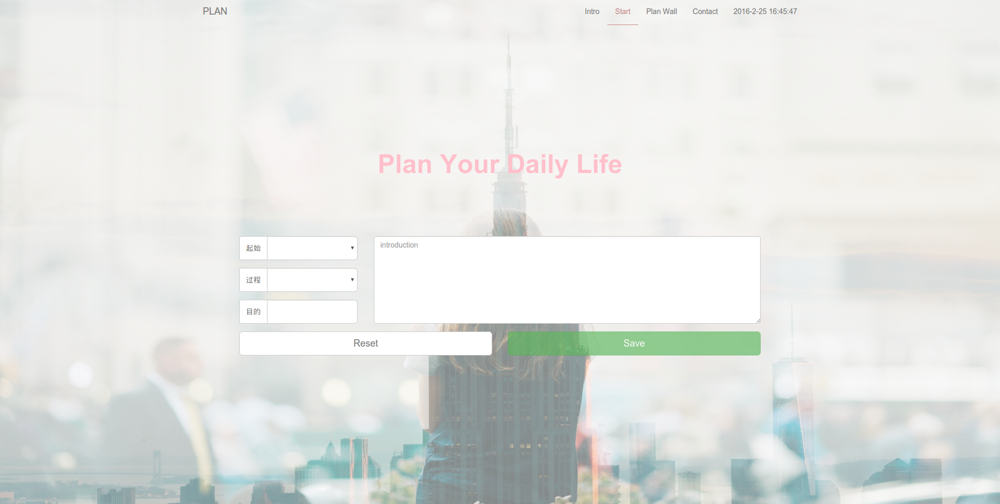
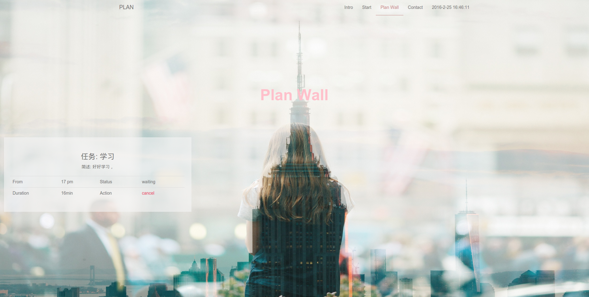
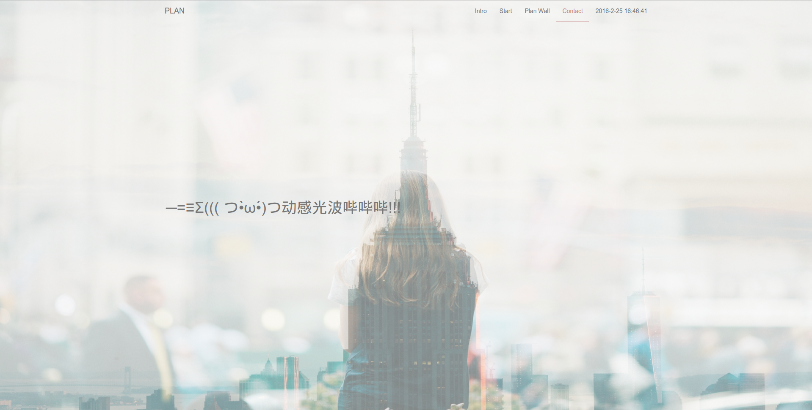

# Plan 单页应用

## 项目效果

## 使用技术

- JavaScript
- Angular1.5
- Bootstrap3.3.5

## 项目总结

### 布局和样式处理

- 每个页面采用的是 `display: table; display: table-cell; vertical-align: middle` 实现的布局
- `body overflow:hidden` 和 `.content translateY` 实现页面之间的平滑过渡效果
- `nav` 部分重置掉了 bootstrap 中 `navbar-default` 和 `.active > a` 的默认样式

### JavaScript & CSS3

- `不借助` 框架实现 `跨浏览器` 事件处理
- 在 `click` 事件 `冒泡` 原理的基础上使用 `事件委托` 机制提高性能
- 借助 `localStorage` `JSON.stringify` 以及 `JSON.parse` 进行数据存储
- 通过 `DOM` 以及 `CSS3 transform transition` 实现页面切换平滑过渡效果

### Angular1.5

- `GetDateCtrl` 控制器实现导航栏部分的时间表

    - `$timeout` 进行定时
    - `{{datetime}}` 进行数据双向绑定
    
- `DesignCtrl` 控制器实现表单数据提交处理并呈现

    - `$timeout` 进行定时
    - `$scope` 负责传递数据并获取数据
    - `ng-options` 实现下拉选择列表
    - `ng-if` 根据条件显示按钮，并使用了 `ng-click` 和 `ng-disabled`
    - `ng-hide` 无任务提示
    - `ng-show` 显示任务状态
    - `ng-repeat` 实现 `html` 重复进而实现计划列表呈现
